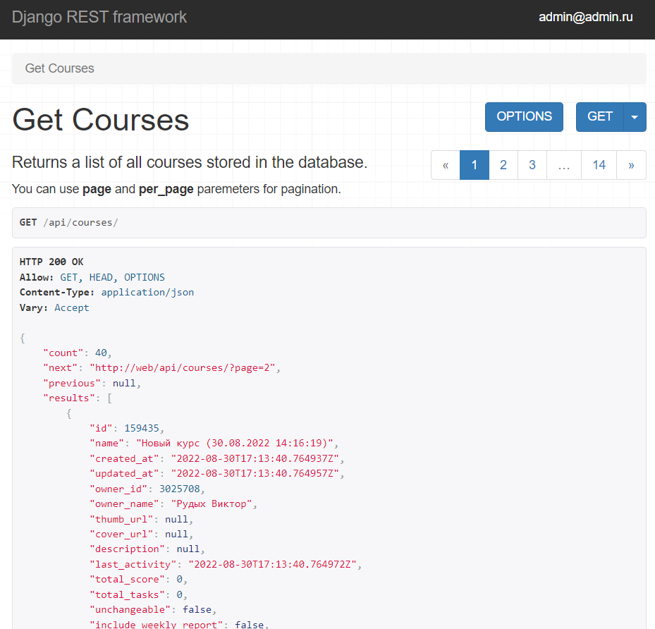
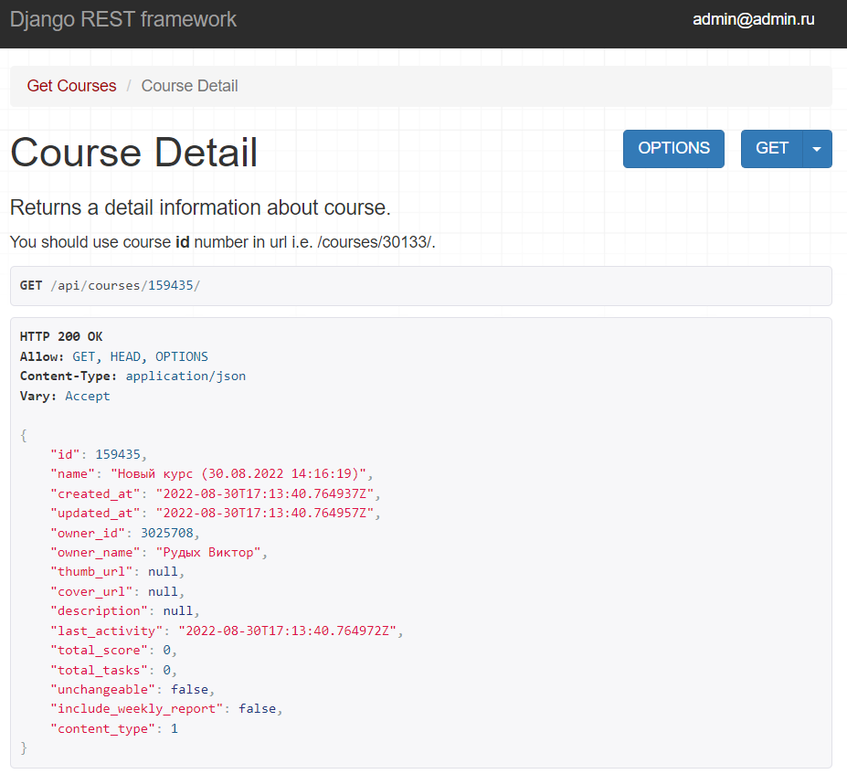
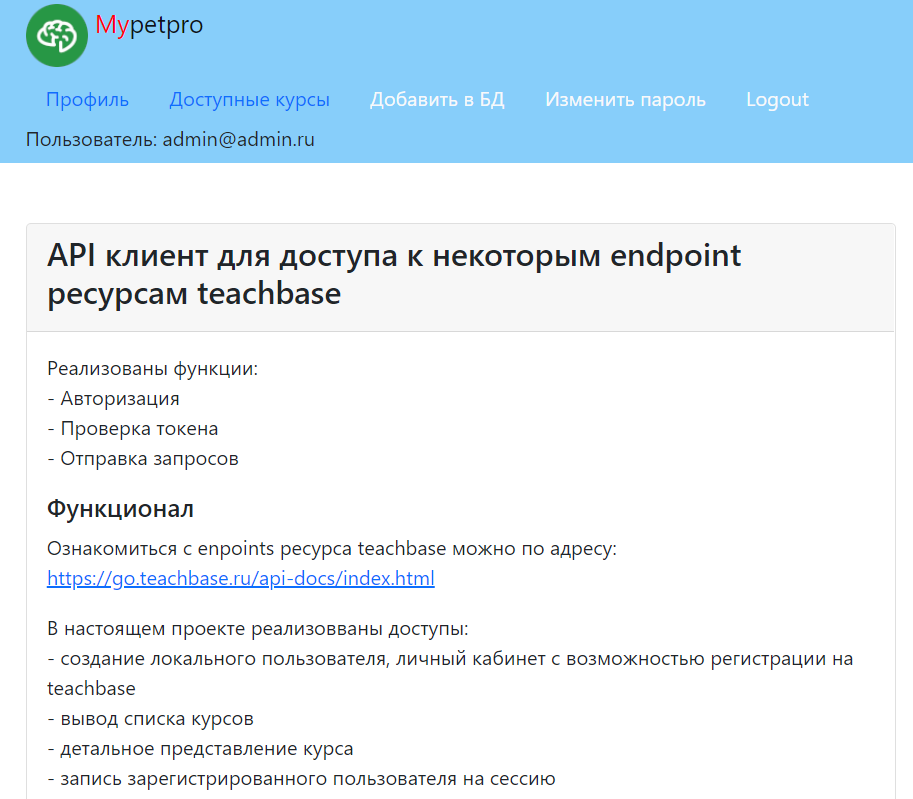
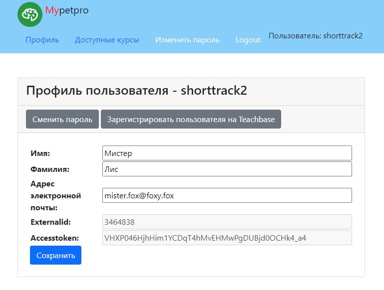
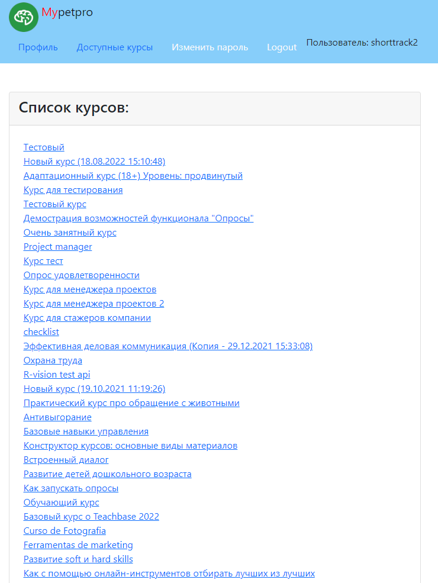
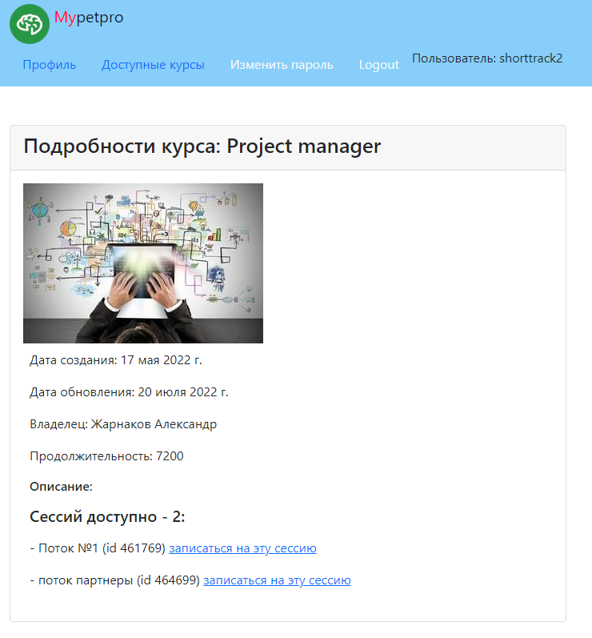

# API клиент для доступа к некоторым endpoint ресурса teachbase 

## Стек технологий
Python, Django, Django REST Framework, PostgreSQL, Docker.

## API (DRF)

api/courses - отдает сохраненные в базе курсы в виде списка
поддерживается пагинация

api/courses/159435 - отдает информацию о выбранном курсе

Главная страница сайта:

## Установка

Для локального запуска, создайте файл `.env` в директории `infra/` с содержанием:

>SECRET_KEY= #любой_секретный_ключ_на_ваш_выбор\
>DEBUG=False\
>DB_ENGINE=django.db.backends.postgresql\
>DB_NAME=postgres\
>POSTGRES_USER=postgres\
>POSTGRES_PASSWORD= #пароль_к_базе_данных_на_ваш_выбор\
>DB_HOST=bd\
>DB_PORT=5432

запустите doker-compose:
>docker-compose --project-directory ./infra up -d --build
### Установка Docker

Для запуска проекта вам потребуется установить `Docker` и `docker-compose`.

Для установки выполните следующие команды:

`sudo apt install docker docker-compose`
Про установку на других операционных системах вы можете прочитать в документации и про установку docker-compose.

## Функционал

Ознакомиться с enpoints ресурса teachbase можно по адресу:
https://go.teachbase.ru/api-docs/index.html

В настоящем проекте реализовваны доступы:

- создание локального пользователя, личный кабинет с возможностью регистрации на teachbase

- вывод списка курсов

- детальное представление курса

- запись зарегистрированного пользователя на сессию

## Установка

1. Клонируйте репозиторий на компьютер:
    >git clone git@github.com:Alexander-Fedorovtsev/teachbase_apiclient.git

2. Создайте и активируйте виртуальное окружение:
    >python -m venv venv
    >source venv/Scripts/activate

3. Установите зависимости:
    >pip install -r requirements.txt

4. Выполните миграции:
    >python manage.py makemigrations
    >python manage.py migrate

5. Запустите сервер локально:
    >python manage.py runserver

перейдите по адресу http://127.0.0.1:8000/

